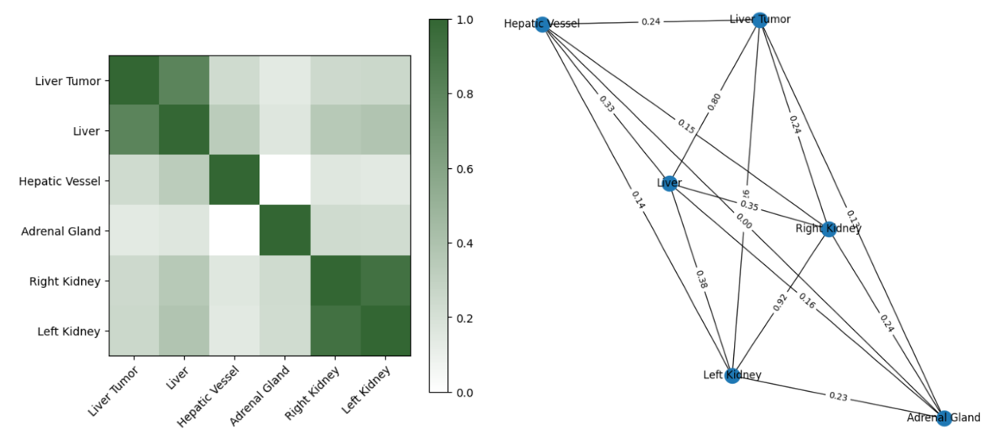
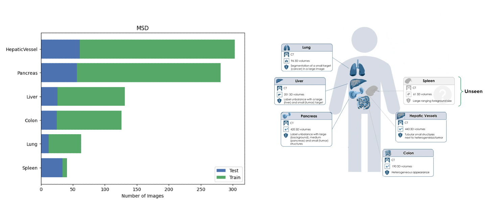
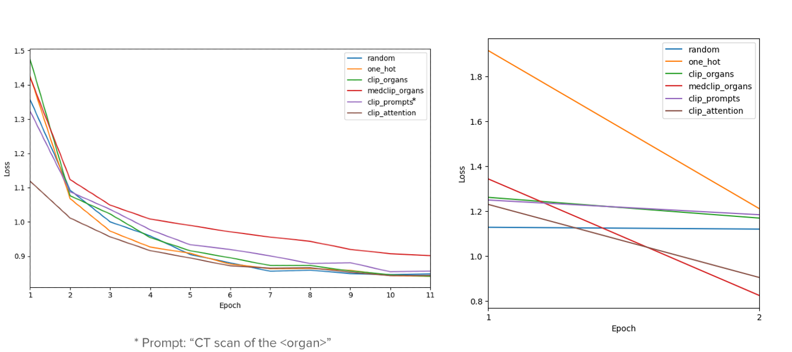
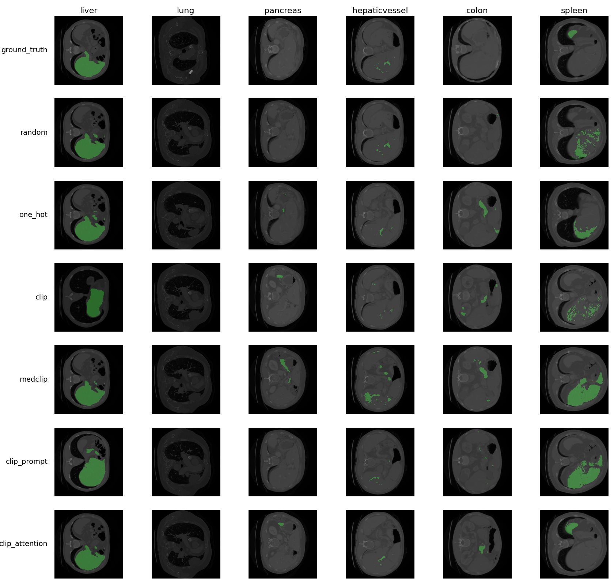
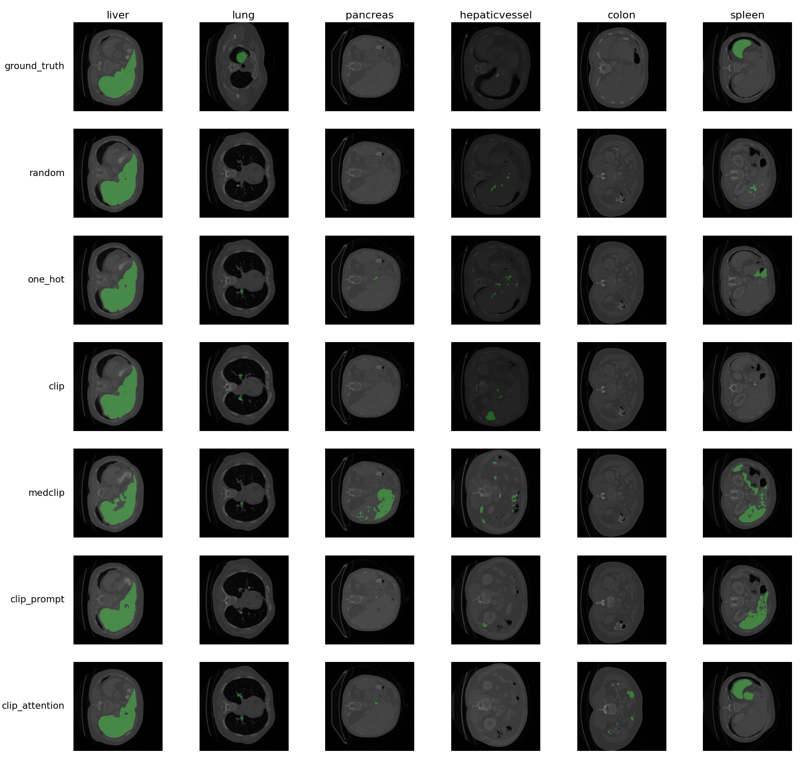
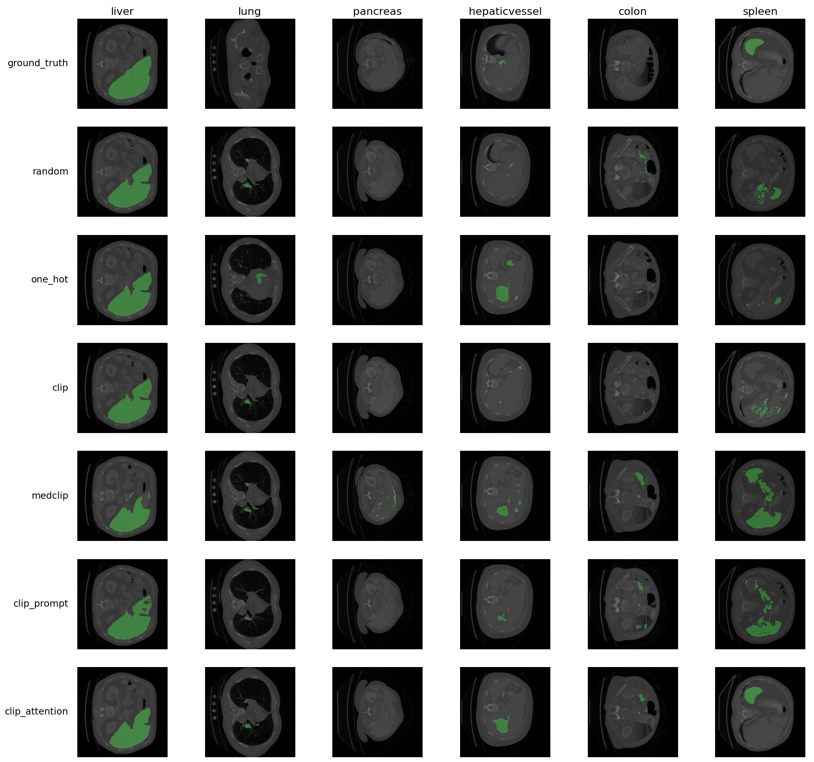
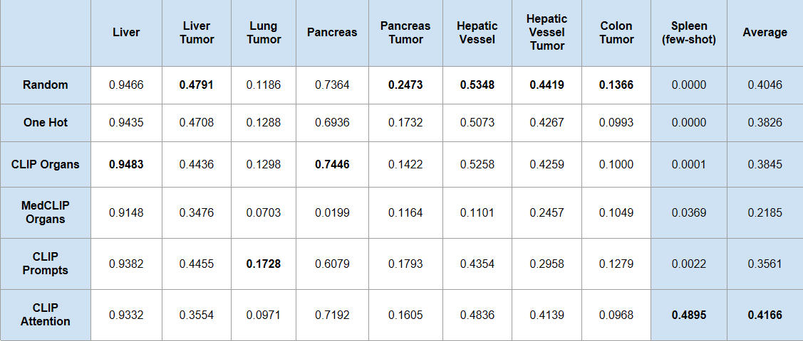
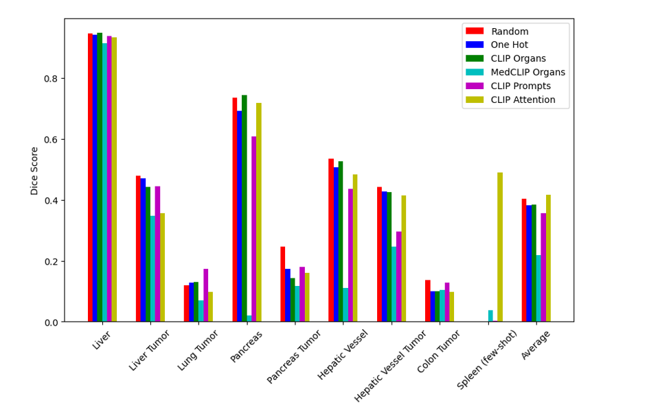

# Exploring-Language-Grounding-for-Few-Shot-Learning-in-3D-Medical-Segmentation

Mohammadreza Dorkhah, Yide Ma

# Model
The architecture of our model is demonstrated as below:


# Repo preparation
If you want to run or develop based on our model, please do this preparation:
First of all download monai medical image preprocess library:
!git clone https://github.com/Project-MONAI/MONAI.git
!cd MONAI/
!BUILD_MONAI=1 python setup.py develop

Then download msd dataset for the universal folder:
Download [msd chanllenge datatset](http://medicaldecathlon.com/). to CLIP-Driven-Universal-Model/dataset/10_Decathlon.
You can also using other datasets and change the dataset_list folder.
The CLIP-Driven-Universal-Model/out folder also contains: rand, one_hot, medclip, clip_prompt, clip_attention, clip.

For the BTCV folder:
download medclip pretrained model:
BTCV/pretrained/medclip-vit/pytorch_model.bin, BTCV/pretrained/medclip-vit/medclip-vit-pretrained

Also download [Swin-UNETR pretrained model](https://github.com/Project-MONAI/research-contributions/tree/main/SwinUNETR/BTCV).

We are also doing some experiments first, download [BTCV challenge dataset](https://www.synapse.org/#!Synapse:syn3193805/wiki/217752).
It should contains text, RegData, RawData. The text folder contains text embedding. The code have contains script to generate.

# Data distribution
Because we are exploring zero shot/few shot, we only msd for experiments. The similarity of msd organs and data distribution are following:



# Training
Because we are doing experiment on few-shot, we trained few epochs for fine-tuning purposes.

Environment: Google Colab Pro+
GPU: NVIDIA A100 with 40 GB of memory
Batch size: 1
Number of epochs: 11
Optimizer: AdamW
Loss: Cross Entropy
Learning rate: 1e-4
Weight decay: 1e-5

The loss graphs:


#Results:
The results examples: (spleen is trained and tested on few-shot)





The numerical results:



# Citation
Thanks great related work.
If you find this repository useful, please consider citing the following papers:

```
@inproceedings{tang2022self,
  title={Self-supervised pre-training of swin transformers for 3d medical image analysis},
  author={Tang, Yucheng and Yang, Dong and Li, Wenqi and Roth, Holger R and Landman, Bennett and Xu, Daguang and Nath, Vishwesh and Hatamizadeh, Ali},
  booktitle={Proceedings of the IEEE/CVF Conference on Computer Vision and Pattern Recognition},
  pages={20730--20740},
  year={2022}
}

@article{hatamizadeh2022swin,
  title={Swin UNETR: Swin Transformers for Semantic Segmentation of Brain Tumors in MRI Images},
  author={Hatamizadeh, Ali and Nath, Vishwesh and Tang, Yucheng and Yang, Dong and Roth, Holger and Xu, Daguang},
  journal={arXiv preprint arXiv:2201.01266},
  year={2022}
}

@article{liu2023clip,
  title={CLIP-Driven Universal Model for Organ Segmentation and Tumor Detection},
  author={Liu, Jie and Zhang, Yixiao and Chen, Jie-Neng and Xiao, Junfei and Lu, Yongyi and Landman, Bennett A and Yuan, Yixuan and Yuille, Alan and Tang, Yucheng and Zhou, Zongwei},
  journal={arXiv preprint arXiv:2301.00785},
  year={2023}
}
```


